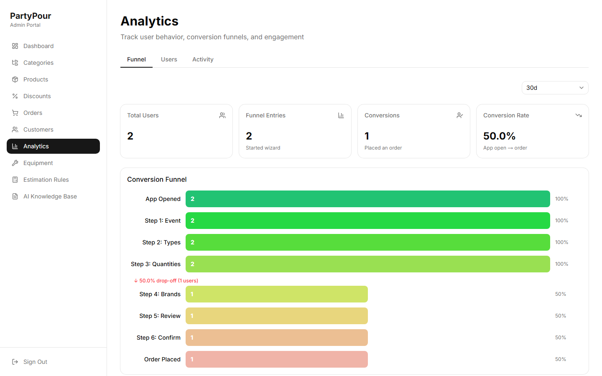
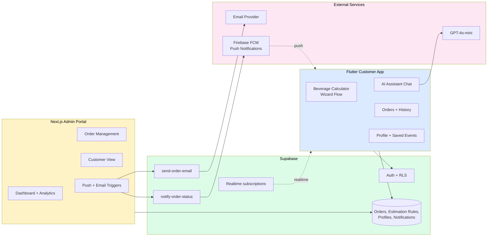

# PartyPour

> **Plan the bar before the party.**
> A Flutter mobile app + Next.js admin portal that calculates exactly how much alcohol, mixers, and ice you need for any event — sized to your guest count, drinking patterns, and event duration. With an AI assistant for the questions you can't answer with a spreadsheet.


---



<p align="center"><em>Admin portal — conversion-funnel analytics (app-open → order). The Flutter customer app is the primary surface; this is the vendor/operator side. Screenshots from the running app (pre-launch).</em></p>

## The problem

Event hosts in Nepal — from house parties to corporate functions — over-buy or under-buy alcohol on nearly every event. Bartenders ballpark, hosts panic the night before, and unused inventory becomes a sunk cost. Existing solutions assume Western drinking patterns; **PartyPour calibrates to local consumption norms** (e.g., units per guest by event type, weighted by drinker mix).

## The solution

A mobile-first calculator that asks 4–6 questions, returns a precise shopping list and per-vendor pricing, and persists your event so you can iterate. Plus an AI chatbot for the long tail ("How much ice for 60 people in summer?") and a vendor-side admin portal for partnered alcohol retailers.

## Architecture



**Two clients, one backend.** Customer app on Flutter (Android-first, iOS-ready), admin portal on Next.js. Both backed by Supabase with edge-function-driven push and email pipelines.

## Engineering decisions

| Concern | Choice | Rationale |
|---|---|---|
| Mobile framework | **Flutter** | Single codebase for Android-first launch with iOS-ready upgrade path; native performance for the calculator's animations |
| Calculator engine | **Estimation rules in DB, not hardcoded** | Tunable per market without app updates; admin-editable for new event types |
| Backend | **Supabase + Edge Functions** | Auth, Postgres, Storage, Realtime, and serverless functions in one platform; fast iteration |
| Notifications | **Edge Function → FCM + Email provider** | Decoupled trigger; orders publish events, edge functions fan out to channels |
| Push | **Firebase FCM** | De-facto Android push standard; reliable cross-vendor delivery |
| Auth | **Supabase Auth** with profiles backfilled on signup | `handle_new_user` trigger with `SET search_path = public` and exception handling for idempotency |
| Admin portal | **Next.js 15 (App Router)** | Server components for analytics-heavy pages; protected by middleware proxy route |
| Quality | **Playwright e2e (admin) + Dart unit tests (mobile)** | E2E for admin flows that touch real data; unit tests for mobile model logic and notification handling |
| Theme | **Premium Gold** — black + gold, Playfair Display + Inter | Differentiates from typical mass-market party apps; positions toward premium events |

## Key features

**Customer app (Flutter):**
- **Calculator wizard** — 4–6 question flow returning a precise shopping list
- **Search-priority browse** for products, with category filters
- **Two-step confirm** before order placement (UX safety pattern)
- **Session persistence** — events saved across app restarts
- **AI chatbot** for non-calculator questions (ice, glassware, mixers ratio)
- **Push notifications** for order status updates
- **Order history** + saved events for reuse

**Admin portal (Next.js):**
- **Dashboard** with analytics (wizard drop-off rates, conversion funnel, revenue)
- **Order management** with status transitions and customer detail
- **Customer list** with order history per customer
- **Push notification triggers** + email triggers via edge functions
- **Phase-1 admin upgrade** complete with Playwright e2e coverage

**Backend:**
- **23 SQL migrations** covering schema evolution, estimation rules, device tokens, realtime notifications, profile email backfill, duplicate event cleanup
- **2 edge functions:** `notify-order-status` (push) and `send-order-email` (email)
- **RLS policies** enforce per-user data isolation

## Status

- **94 commits** across mobile + admin + backend
- **MVP demoable** end-to-end (customer order → admin processes → push back to customer)
- **Play Store launch** in pre-launch checklist phase
- Admin portal deployed to Vercel for partner testing
- Renamed from "RaksiChaiyo" to "PartyPour" mid-development

## Tech stack

**Mobile:** Flutter, Dart, Material 3, Provider/Riverpod state, FCM
**Admin:** Next.js 15 (App Router), TypeScript, Tailwind, shadcn/ui
**Backend:** Supabase (Auth, Postgres + RLS, Storage, Realtime), Deno edge functions
**Testing:** Playwright (admin e2e), Dart unit tests (mobile models, services)
**Notifications:** Firebase Cloud Messaging + transactional email provider

## Repo tour

```
customer_app/lib/        # Flutter customer app
  screens/               #   home, 5-step calculator wizard, catalog, cart, checkout, orders
  providers/             #   app state
  services/              #   Supabase + API calls
  models/  widgets/  config/
admin_portal/src/        # Next.js admin portal (dashboard, orders, products, analytics)
supabase/
  migrations/            # 23 migrations — catalog, orders, customers, analytics (RLS)
  functions/             # Deno edge functions (AI assistant, notifications)
mockups/                 # HTML design-exploration previews (internal)
```

## Local development

```bash
# Customer app (Flutter)
cd customer_app
flutter pub get
flutter run  # connect Android device or emulator first

# Admin portal (Next.js)
cd admin_portal
npm install
cp .env.example .env.local  # fill Supabase URL + service role key
npm run dev

# Edge functions (deploy to Supabase)
cd supabase/functions
supabase functions deploy notify-order-status
supabase functions deploy send-order-email
```

See `HOW_TO_RUN.txt` for full quick-reference and `KNOWN_ISSUES_AND_FIXES.txt` for the running incident log.

## Roadmap

- [x] Beverage calculator engine + wizard
- [x] AI chat assistant
- [x] Mobile auth + profile + orders
- [x] Admin portal Phase 1 (orders, customers, analytics)
- [x] Push + email notification pipelines
- [x] Realtime order status updates
- [x] Playwright admin e2e suite
- [ ] Beta testing rollout
- [ ] Play Store submission
- [ ] Vendor partner onboarding (Phase 2)
- [ ] iOS build + TestFlight

## About

Built by **Sadip Wagle** — AI Solutions Architect, formerly Co-Founder of **Datambit (London, 2023–2025)** with production AI experience for the **UK Home Office, Royal Navy, Mastercard,** and **Nationwide**. Currently based in Kathmandu, building indigenous AI products for Nepal.

- **LinkedIn:** [sadip-wagle](https://www.linkedin.com/in/sadip-wagle-711245b7/)
- **GitHub:** [@wsadip-tech-ai](https://github.com/wsadip-tech-ai)
- **Email:** waglesadip79@gmail.com

---

*PartyPour is part of a portfolio that also includes [Astra](https://github.com/wsadip-tech-ai/Astra) (astrology AI), [Pasal AI](https://github.com/wsadip-tech-ai/pasal-ai) (Nepali DM-commerce AI), [Kaam](https://github.com/wsadip-tech-ai/Kaam) (home services), and [WedMe](https://github.com/wsadip-tech-ai/WedMe) (event direct-booking).*
